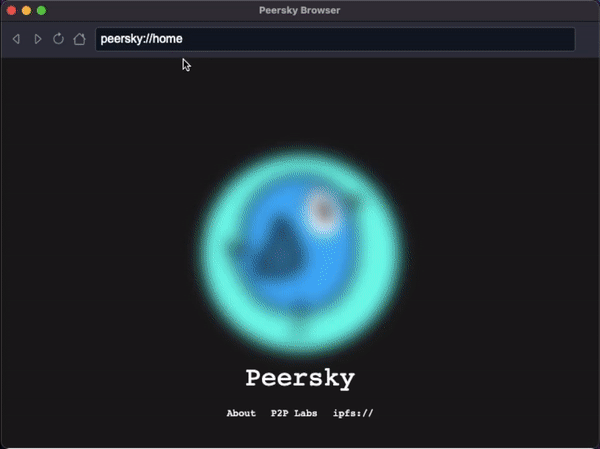

<p align="center">
    </img>
</p>

<h1 align="center">Peersky Browser</h1>

<div align="center">
    
    
    
</div><br>

💻 [Download](https://peersky.p2plabs.xyz/)

<!-- <div>
  
</div> -->

## 🛠 Development

- Install dependencies

```bash
npm install
```

- Start the app

```bash
npm start
```

- Build
  After development of the browser, run the following command. This will create a `production` build.

```bash
npm run build
# For Intel and M1 macs
```

Now, the `dist` folder will appear in the root directory.

```bash
npm run build-all
# For macOS, Linux, and Windows
```

## 🚧 Roadmap

- [x] Basic browser navigation:

  - [x] Back
  - [x] Forward
  - [x] Reload
  - [x] Home page (peersky://home)

- [x] IPFS protocol handler:

  - [x] Run a local [Helia](https://helia.io/) node
  - [x] `ipfs://` / `ipns://` native URLs support
  - [x] Directory listings support

- [x] Hypercore protocol handler:

  - [x] Run a local [hyper](https://holepunch.to/) node
  - [x] `hyper://` native URLs support

- [x] Web3 protocol handler:

  - [x] Run a local [web3](https://github.com/web3-protocol/web3protocol-js) node
  - [x] `web3://` native URLs support

- [x] P2P Applications:

  - [x] `peersky://p2p/chat/index`
    - Peer-to-peer messaging
  - [x] `peersky://p2p/upload/index`
    - Decentralized file storage
  - [x] `peersky://p2p/editor/index`
    - Build and publish websites
  - [x] [Social Reader](https://reader.distributed.press/)
    - A p2p offline client for reading and following microblogs on the fediverse.

- [x] Electron’s Auto-updater:

  - [x] Download and install the latest release from Github automatically

- [x] Context menu:

  - [x] Back / Forward
  - [x] Reload
  - [x] Inspect
  - [x] Undo / Redo
  - [x] Cut / Copy / Paste
  - [x] Copy Link Address
  - [x] Open Link in New Tab 

- [x] Find in page:
  - [x] Search for text within a document or web page

- [x] Keyboard shortcuts:

  - [x] New Window: `CommandOrControl+N`
  - [x] Back: `CommandOrControl+[`
  - [x] Forward: `CommandOrControl+]`
  - [x] Reload: `CommandOrControl+R`
  - [x] Find in Page: `CommandOrControl+F`
  - [x] Open Dev Tools: `CommandOrControl+Shift+I`
  - [x] Focus URL Bar: `CommandOrControl+L`
  - [x] Minimize: `CommandOrControl+M`
  - [x] Close: `CommandOrControl+W`
  - [x] Toggle Full Screen: `F11`

- [ ] Settings (peersky://settings):

  - [ ] Option to hide/show the clock
  - [ ] Option to change themes
  - [ ] Option to set home wallpapers

- [ ] History (peersky://history):

  - [ ] Suggestions based on the browser history when typing in URL prompt

- [ ] Bookmarks (peersky://bookmarks):

  - [ ] Option to add favourite pages in the nav bar (peersky://bookmarks)

- [ ] QR Code generator:

  - [ ] Option to generate QR Code for every page in the URL prompt

- [ ] Web extensions:
  - [ ] In-browser extensions
    - [Ad-blocker](https://github.com/gorhill/uBlock)
    - [DScan](https://github.com/p2plabsxyz/dscan)
    - ..
  - [ ] Load extensions from folders

## 📄 Contribute

- Thanks for your interest in contributing to Peersky Browser. There are many ways you can contribute to the project.
- To start, take a few minutes to read the "[contribution guide](https://github.com/p2plabsxyz/peersky-browser/blob/main/.github/CONTRIBUTING.md)".
- We look forward to your [pull requests](https://github.com/p2plabsxyz/peersky-browser/pulls) and / or involvement in our [issues page](https://github.com/p2plabsxyz/peersky-browser/issues).

## ⚖️ License

Peersky Browser is licensed under the [MIT License](https://github.com/p2plabsxyz/peersky-browser/blob/main/LICENSE).

<hr>
Don't forget to leave a star ⭐️ ~ <a href="https://twitter.com/PeerskyBrowser" target="_blank"></a>
