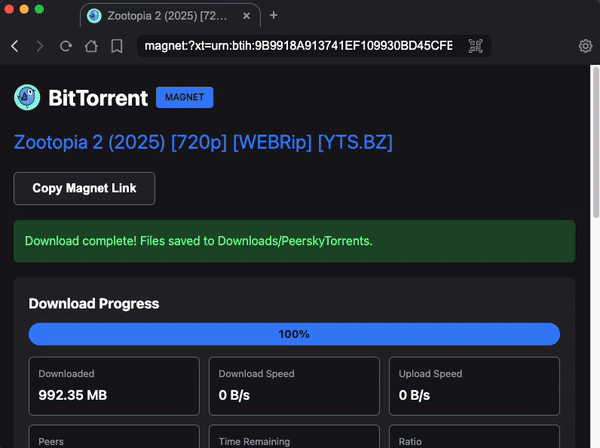
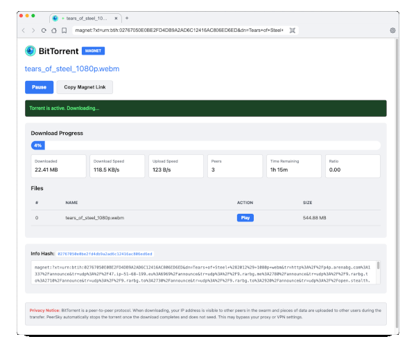

# BitTorrent Protocol

Peersky supports BitTorrent downloading and streaming natively using [WebTorrent](https://webtorrent.io/). Torrents run in an isolated child process to avoid blocking the browser.

> [Tears of Steel](https://en.wikipedia.org/wiki/Tears_of_Steel) is an open-source short film released under a Creative Commons license, so sharing and downloading it is permitted.

## Supported URL Schemes

- `bittorrent://<infohash>` — open a torrent by info hash
- `bt://<infohash>` — shorthand for `bittorrent://`
- `magnet:?xt=urn:btih:<infohash>` — standard magnet links

All three schemes load the same torrent download UI.

## How It Works

1. **Navigate** to a `bt://`, `bittorrent://`, or `magnet:` URL
2. **Click "Start Torrent"** to begin downloading
3. **Monitor progress** — real-time stats (speed, peers, ETA) update every 2 seconds
4. **Pause / Resume** — pause stops all peer connections and data transfer
5. **Download completes** — torrent is destroyed automatically (no seeding)
6. **Open files** — click "Play" (media) or "Open" (other files) to view in a new tab

Files are saved to `<Downloads>/PeerskyTorrents/` (your system's default Downloads folder).

## Architecture

- **`src/protocols/bittorrent-handler.js`** — protocol handler, status cache, API routing
- **`src/protocols/bt/worker.js`** — runs WebTorrent client in a separate Node.js process
- **`src/protocols/bt/torrentPage.js`** — generates the HTML/JS torrent page UI

## API Endpoints

The torrent page communicates with the handler via `bt://api?action=api&api=<action>`:

| API | Description |
|-----|-------------|
| `start` | Start a torrent. Params: `magnet=<uri>` |
| `status` | Get cached status. Params: `hash=<infohash>` |
| `pause` | Pause a torrent. Params: `hash=<infohash>` |
| `resume` | Resume a paused torrent. Params: `hash=<infohash>` |
| `remove` | Remove a torrent. Params: `hash=<infohash>` |

## Privacy & Safety

- **No seeding** — torrents are destroyed immediately on completion
- **LAN discovery disabled** — `lsd`, `natUpnp`, `natPmp` are all off
- **IP visibility** — your IP is visible to peers during download (standard BitTorrent behavior)
- **Upload during download** — pieces are shared with peers while downloading (BitTorrent protocol requirement)
- **Isolated process** — WebTorrent runs in a child process; a crash won't take down the browser

## Opening Downloaded Files

Downloaded files open in a new browser tab via `file://` URLs. This uses an IPC bridge (`open-url-in-tab`) because Electron blocks direct `file://` navigation from custom protocol pages. The IPC handler only accepts `file://` URLs for security.

Media files (video, audio) stream instantly thanks to HTTP Range request support in the file protocol handler (`src/protocols/file-handler.js`).

> [!IMPORTANT]
> **Intended Use**: This BitTorrent feature is designed to download and stream legally distributed media only. This may include entertainment content where the user has explicit rights to access and download it. It is designed for **downloading only** — torrents are destroyed immediately on completion (no seeding) to avoid redistribution. Peersky does not support or condone piracy or copyright infringement; users are responsible for ensuring they have the rights to access the content and for complying with applicable laws.
