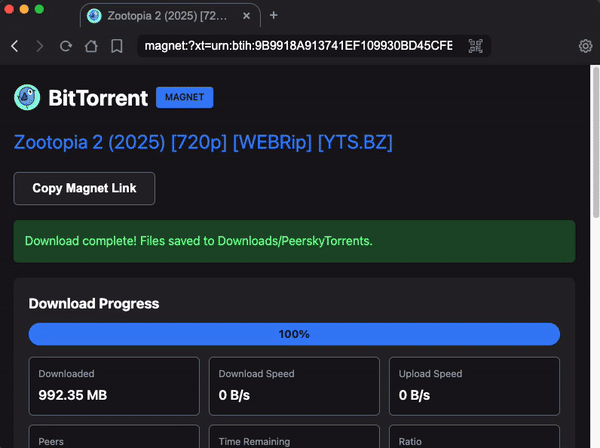
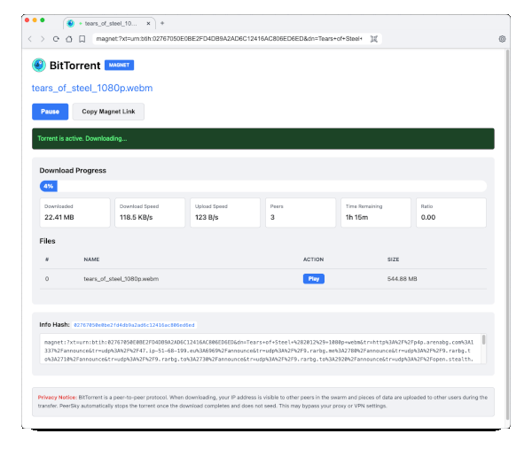

# BitTorrent Protocol

Peersky supports BitTorrent downloading and streaming natively using [WebTorrent](https://webtorrent.io/). Torrents run in an isolated child process to avoid blocking the browser.

> [Tears of Steel](https://en.wikipedia.org/wiki/Tears_of_Steel) is an open-source short film released under a Creative Commons license, so sharing and downloading it is permitted.

## Supported URL Schemes

- `bittorrent://<infohash>` — open a torrent by info hash
- `bt://<infohash>` — shorthand for `bittorrent://`
- `magnet:?xt=urn:btih:<infohash>` — standard magnet links

All three schemes load the same torrent download UI.

Peersky also provides a global BitTorrent manager page at `peersky://bt/` for viewing and controlling all cached torrents in one place.

### Opening Local Torrent Files
You can drag and drop a local `.torrent` file directly onto the browser's address bar. The browser will automatically parse the file to obtain its infohash and resolve it to a `magnet:` URI, opening the standard torrent start page.

## How It Works

1. **Navigate** to a `bt://`, `bittorrent://`, or `magnet:` URL
2. **Click "Start Torrent"** to begin downloading
3. **Monitor progress** — real-time stats (speed, peers, ETA) update every 2 seconds
4. **Pause / Resume** — pause stops all peer connections and data transfer
5. **Download completes** — torrent stops automatically by default (no seeding)
6. **Optional seeding** — click **Start Seeding** only if you intentionally want to share content
7. **Stop seeding anytime** — click **Stop Seeding** to end active seeding and return to non-seeding state
8. **Stop torrent session** — click **Stop Torrent** to stop the active session while keeping it in the manager list
9. **Open files** — click "Play" (media) or "Open" (other files) to view in a new tab

## Global Torrent Manager (`peersky://bt/`)

Use `peersky://bt/` to manage all torrents from one page.

- View cached torrents and status (`downloading`, `paused`, `stopped`, `seeding`, `done`)
- Open a torrent page (`bt://<infohash>`)
- Run actions: `Pause`, `Resume`, `Start Seeding`, `Stop Seeding`, `Stop`, `Remove`
- Copy `infoHash` or full magnet URI
- Search and paginate results (10 items per page, shared pagination component)

Files are saved to `<Downloads>/PeerskyTorrents/` (your system's default Downloads folder).

## Architecture

- **`src/protocols/bittorrent-handler.js`** — protocol handler, status cache, API routing
- **`src/protocols/bt/worker.js`** — runs WebTorrent client in a separate Node.js process
- **`src/protocols/bt/torrentPage.js`** — generates the HTML/JS torrent page UI

## API Endpoints

The torrent page communicates with the handler via `bt://api?action=api&api=<action>`:

| API | Description |
|-----|-------------|
| `start` | Start a torrent. Params: `magnet=<uri>` |
| `seed` | Explicitly enable seeding for a torrent. Params: `hash=<infohash>` and/or `magnet=<uri>` |
| `unseed` | Stop active seeding without removing from manager list. Params: `hash=<infohash>` |
| `status` | Get cached status. Params: `hash=<infohash>` |
| `list` | Get all cached torrent statuses for manager UI |
| `token` | Issue UI API token for mutation requests from internal BT pages |
| `pause` | Pause a torrent. Params: `hash=<infohash>` |
| `resume` | Resume a paused torrent. Params: `hash=<infohash>` |
| `stop` | Stop active torrent session but keep cached entry. Params: `hash=<infohash>` |
| `remove` | Remove a torrent. Params: `hash=<infohash>` |

## Privacy & Safety

- **Default no-seeding** — torrents stop automatically on completion unless you explicitly choose **Start Seeding**
- **LAN / NAT defaults** — normal downloads keep `lsd`, `natUpnp`, and `natPmp` off. When you use **Start Seeding** and no other torrents are active, the worker switches to a seeding network profile with those features on and an upload cap; when seeding stops and the client is idle, it switches back.
- **IP visibility** — your IP is visible to peers during download, and while seeding if you enable it
- **Upload during download** — pieces are shared with peers while downloading (BitTorrent protocol requirement)
- **Stop control** — you can stop active seeding at any time using **Stop Seeding**
- **Session control semantics** — `pause` keeps torrent in active worker state; `stop` ends active worker session; `remove` deletes cached entry
- **Isolated process** — WebTorrent runs in a child process; a crash won't take down the browser

## Opening Downloaded Files

Downloaded files open in a new browser tab via `file://` URLs. This uses an IPC bridge (`open-url-in-tab`) because Electron blocks direct `file://` navigation from custom protocol pages. The IPC handler only accepts `file://` URLs for security.

Media files (video, audio) stream instantly thanks to HTTP Range request support in the file protocol handler (`src/protocols/file-handler.js`).

> [!IMPORTANT]
> **Intended Use**: This BitTorrent feature is designed to download and stream legally distributed media only. This may include entertainment content where the user has explicit rights to access and download it. By default, torrents auto-stop on completion (no seeding). Optional seeding is a user-triggered action intended for legitimate hosting/sharing use-cases; users are responsible for legal compliance and understanding that IP visibility applies while participating in a swarm.
