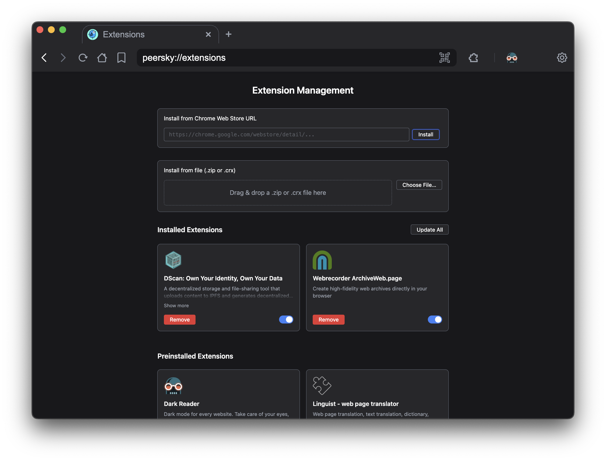

# Peersky Extensions (`peersky://extensions`)

## 1. Overview

PeerSky’s `peersky://extensions` page is the control center for managing browser extensions. You can install from the Chrome Web Store or local files, enable/disable, update, uninstall, and see toolbar actions for supported extensions.

Highlights
- Three MV3 extensions ship preinstalled (Dark Reader, Linguist - web page translator, uBlock Origin Lite) on first launch; they stay installed but can be disabled any time.
- Context-isolated preload exposes only what this page needs, keeping privileged APIs out of `peersky://extensions`.
- Browser actions integrate with the toolbar/puzzle menu, support pinning up to six entries.

## 2. User Guide

Quick start
- Preinstalled: three trusted extensions (Dark Reader, Linguist - web page translator, uBlock Origin Lite) ship enabled and can be disabled but not removed.
- Install from Web Store: paste a Chrome Web Store URL, a `?id=` link, or the raw 32-character ID → Install.
- Install from file: drag/drop a `.zip`, `.crx`, `.crx3` or use Choose File.

Common actions
- Enable/Disable: use the toggle on each card.
- Update: click Update All (Web Store installs only).
- Uninstall (non-preinstalled only): click Remove and confirm.
- Toolbar actions: appear under the puzzle menu; up to 6 can be pinned for quick access.

Pinning rules
- Cap stays at six to keep the puzzle menu within 320 px and avoid cramped hover targets.
- Limit is not yet configurable; trying to pin a seventh shows a toast and responds with `E_PIN_LIMIT`.
- Overflow does not evict automatically—unpin something first.

Icons
- Served via `peersky://extension-icon/<id>/<size>` from the latest installed version.
- A default SVG is used when no icon is found.

## 3. Electron Integration: Why Preload + IPC

We use Electron’s `contextBridge` + `ipcRenderer` pattern to give this page only the tools it needs.

Why not inject scripts?
- ✖ Harder to audit and secure; leaks privileges.
- ✖ Timing/race issues on page load.

Why preload + IPC is better
- ✅ APIs exposed at preload, scoped to `peersky://extensions` only.
- ✅ Main process stays isolated; every operation is validated.
- ✅ Clear mapping from renderer to IPC handlers for auditing.

Security highlights
- Installs are rate-limited to five attempts per renderer per minute; hitting the limit returns `E_RATE_LIMIT` until the window expires.
- 60 MB hard cap on uploads and blobs; oversized payloads reject before disk writes with `E_INVALID_PATH`.
- ZIP/CRX extraction with zip-slip prevention (rejects on normalized path escape).
- Manifest V3 required by default; permission and host-permission checks.
- Icons streamed read-only via a custom protocol handler.
- Web Store installs flow through `electron-chrome-web-store`, relying on Google-signed CRX verification; no extra signature layer beyond the store.

## 4. Extensions API: Preload + IPC

The preload (`src/pages/unified-preload.js`) exposes `window.electronAPI.extensions` for this page.

Management & install (all IPC channels follow the `extensions-<action>` pattern)

| Method | IPC Channel | Returns | Errors | Notes |
|---|---|---|---|---|
| `listExtensions()` | `extensions-list` | `{ success: boolean; extensions: ExtensionSummary[] }` | `E_UNKNOWN` (unexpected) | Idempotent read. |
| `getExtensionInfo(id)` | `extensions-get-info` | `{ success: boolean; extension?: ExtensionSummary }` | `E_INVALID_ID` | Idempotent read. |
| `getStatus()` | `extensions-status` | `{ success: boolean; status: { installed: number; enabled: number; queue: string[] } }` | `E_UNKNOWN` | Idempotent read. |
| `toggleExtension(id, enabled)` | `extensions-toggle` | `{ success: boolean; result: true }` | `E_INVALID_ID`, `E_LOAD_FAILED`, `E_REMOVE_FAILED` | Not idempotent when re-applying `true` (reloads). |
| `uninstallExtension(id)` | `extensions-uninstall` | `{ success: boolean; result: true }` | `E_INVALID_ID`, `E_REMOVE_FAILED` | Not idempotent; second call fails. |
| `openInstallFileDialog()` | `extensions-show-open-dialog` | `{ success: boolean; path?: string; canceled?: boolean }` | `E_UNKNOWN` | Safe to call repeatedly. |
| `installExtension(path)` | `extensions-install` | `{ success: boolean; extension: ExtensionSummary }` | `E_INVALID_PATH`, `E_ALREADY_EXISTS`, `E_INSTALL_FAILED`, `E_RATE_LIMIT` | Not idempotent; duplicate paths return `E_ALREADY_EXISTS`. |
| `installFromBlob(name, arrayBuffer)` | `extensions-install-upload` | `{ success: boolean; extension: ExtensionSummary }` | `E_INVALID_PATH`, `E_RATE_LIMIT` | Validates extension suffix and size. |
| `installFromWebStore(urlOrId)` | `extensions-install-webstore` | `{ success: boolean; id: string; extension: ExtensionSummary }` | `E_INVALID_URL`, `E_ALREADY_EXISTS`, `E_INSTALL_FAILED`, `E_RATE_LIMIT` | Accepts full URL, `?id=`, or raw 32-char ID. |
| `updateAll()` | `extensions-update-all` | `{ success: boolean; updated: string[]; skipped: string[]; errors: { id: string; message: string }[] }` | `E_UPDATE_FAILED` | Re-entrant; reruns check. |
| `unpinExtension(id)` | `extensions-unpin` | `{ success: boolean; unpinned?: boolean }` | `E_UNKNOWN` | Idempotent; returns true if already unpinned. |
| `cleanupRegistry()` | `extensions-cleanup-registry` | `{ success: boolean; initialCount: number; finalCount: number; removedCount: number; removedExtensions: RemovedEntry[] }` | `E_UNKNOWN` | Idempotent scan/repair. |
| `getIconUrl(id, size)` | `extensions-get-icon-url` | `{ success: boolean; iconUrl: string|null }` | `E_INVALID_ID` | Sizes: 16/32/48/64/128; defaults to 64. |

Toolbar & browser surface

| Method | IPC Channel | Returns | Errors | Notes |
|---|---|---|---|---|
| `getBrowserActions()` | `extensions-list-browser-actions` | `{ success: boolean; actions: BrowserActionSummary[] }` | `E_UNKNOWN` | Idempotent per window. |
| `clickBrowserAction(actionId)` | `extensions-click-browser-action` | `{ success: boolean }` | `E_INVALID_ID`, `E_INVALID_STATE` | No-op if action missing. |
| `openBrowserActionPopup(actionId, anchorRect)` | `extensions-open-browser-action-popup` | `{ success: boolean }` | `E_INVALID_ID`, `E_INVALID_STATE` | Normalizes `anchorRect`. |
| `registerWebview(webContentsId)` | `extensions-register-webview` | `{ success: boolean }` | `E_INVALID_ID` | Requires same host `webContents`. |
| `unregisterWebview(webContentsId)` | `extensions-unregister-webview` | `{ success: boolean }` | `E_INVALID_ID` | Idempotent; destroyed views ignored. |

Canonical error codes
- `E_INVALID_ID`, `E_INVALID_URL`, `E_INVALID_PATH`
- `E_ALREADY_EXISTS`, `E_RATE_LIMIT`, `E_PIN_LIMIT`
- `E_INSTALL_FAILED`, `E_LOAD_FAILED`, `E_REMOVE_FAILED`, `E_UPDATE_FAILED`
- `E_INVALID_STATE`, `E_UNKNOWN`

Events (each call returns an unsubscribe function; invoking the unsubscribe twice is safe)
- `onExtensionInstalled(cb: (payload: { extension: ExtensionSummary }) => void)`
- `onExtensionChanged(cb: (payload: { extension: ExtensionSummary }) => void)`
- `onExtensionUninstalled(cb: (payload: { id: string }) => void)`
- `onBrowserActionChanged(cb: (payload: { actions: BrowserActionSummary[] }) => void)`
- `onExtensionError(cb: (payload: { id?: string; code: string; message: string; meta?: Record<string, unknown> }) => void)`

Notes
- In this page, Settings API access is limited to theme queries.
- Install attempts are rate-limited per renderer (5 per minute) and uploads are capped at 60 MB.
- Rate-limit overflow replies with `{ success: false, code: 'E_RATE_LIMIT' }`; retry after the 60s window clears.

## 5. Developer Guide

Architecture
- `src/extensions/index.js`: ExtensionManager orchestrates lifecycle, validation, and session wiring.
- `src/extensions/services/loader.js`: shared install helpers used by directory/archive installers.
- `src/extensions/services/installers/`: per-source installers (`archive.js`, `directory.js`).
- `src/extensions/services/registry.js`: registry I/O, manifest string resolution, pin persistence.
- `src/extensions/services/browser-actions.js`: toolbar integration and popup window lifecycle.
- `src/extensions/services/webstore.js`: Chrome Web Store download/update/publish logic.
- `src/extensions/mutex.js`: keyed install/update locks used to prevent concurrent writes.
- `src/extensions/extensions-ipc.js`: IPC surface used by the preload API.
- `src/extensions/chrome-web-store.js`: thin wrapper around `electron-chrome-web-store`.
- `src/pages/unified-preload.js`: context detection and `window.electronAPI.extensions` exposure.

User data layout
- Base: `<userData>/extensions/`
- Registry: `extensions.json`
- Pinned: `pinned.json` (max 6 pinned for toolbar)
- Staging/Uploads: `_staging/`, `_uploads/`
- Installation root: `<id>/<version>_0/`

Lifecycle
- Install (Web Store): parse/validate ID → download → load → write registry.
- Install (local/blob): validate path/blob → extract → load if enabled → write registry.
- Toggle: load/remove via Electron Session; persist state to registry.
- Update all: Web Store check → pick latest version dir → reload if enabled → update registry.
- Uninstall: unload → remove files → update registry (and Web Store uninstall if applicable).

Preinstalled extensions
Preinstalled packages are imported on first launch, marked `isSystem: true` and `removable: false`, and ride the normal update track. Disablement is still allowed so users can opt out.
1. Drop the MV3 package in `src/extensions/preinstalled-extensions/` (either unpacked directory or `.zip` archive) and ensure its `manifest.json` lives at the top level.
2. Run `node scripts/postinstall.js` (or reinstall dependencies) to regenerate `preinstalled.json` when working with directories—this calculates deterministic IDs.
3. If you store archives, add or update the matching entry in `preinstalled.json` with `archive`, `name`, `version`, and the generated `id`.
4. Launch the browser once to verify the package is imported and marked `isSystem`/`removable: false`.

Validation & security
- `policy.js`: MV3 default, file allow/deny lists, size caps, behavior.
- `manifest-validator.js`: required fields, semantic versioning, permission/host risk checks, Web Store URL allowlist.
- `zip.js`/`crx.js`: safe extraction and CRX parsing; optional key recovery via `chrome-extension-fetch`.
- Session hardening: `contextIsolation=true`, `sandbox=true`, no Node integration in webviews.

## 6. MV3 & Permissions

- MV3 service workers ride on `electron-chrome-extensions`; they go idle after Chromium's ~30 s timer and wake on events, alarms, or network listeners. We do not pin them alive.
- Browser-action popups run in dedicated windows; `popup-guards` redirect `window.open`/`will-navigate` to real tabs so OAuth flows stay in trusted chrome.
- Manifest `permissions` and `host_permissions` are validated at install. Risky hosts (`*://*/*`, LAN ranges, etc.) surface warnings in `extension.warnings` for UI review.
- Optional permission prompts (`chrome.permissions.request`) are currently blocked; calls reject with `E_INVALID_STATE` so extensions must declare needed hosts up front.
- Runtime host-permission reviews are manual today—disable the extension or uninstall if the warning set looks unsafe.

## 7. File Reference

| File | Purpose |
|---|---|
| `src/pages/extensions.html` | Page layout & hooks |
| `src/pages/static/js/extensions-page.js` | Renderer logic (list/install/toggle/uninstall/update) |
| `src/pages/theme/extensions-page.css` | Styling for extensions page |
| `src/pages/unified-preload.js` | Scoped API exposure |
| `src/extensions/index.js` | ExtensionManager entry point |
| `src/extensions/extensions-ipc.js` | IPC handlers for renderer ↔ main |
| `src/extensions/mutex.js` | Install/update locks |
| `src/extensions/util.js` | Shared helpers, error codes, atomic writes |
| `src/extensions/manifest-validator.js` | Manifest + permissions validation |
| `src/extensions/policy.js` | Default policy and overrides |
| `src/extensions/services/loader.js` | Shared loader for installers |
| `src/extensions/services/installers/archive.js` | Archive install pipeline |
| `src/extensions/services/installers/directory.js` | Directory install pipeline |
| `src/extensions/services/registry.js` | Registry and pin persistence |
| `src/extensions/services/browser-actions.js` | Toolbar/popup integration |
| `src/extensions/services/webstore.js` | Web Store orchestration |
| `src/extensions/services/popup-guards.js` | Navigation guards for action popups |
| `src/extensions/zip.js` | ZIP extraction with zip-slip prevention |
| `src/extensions/crx.js` | CRX parsing and extraction |
| `src/extensions/chrome-web-store.js` | Web Store wrapper |
| `src/extensions/utils/ids.js` | Deterministic ID generator |
| `src/extensions/utils/strings.js` | Manifest i18n helpers |
| `src/protocols/peersky-protocol.js` | `peersky://extension-icon` route and page serving |
| `src/main.js` | Initialization & session setup |
