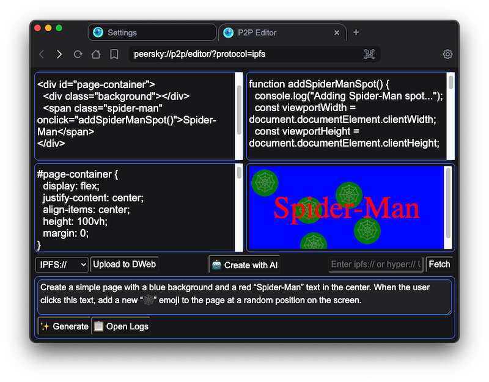
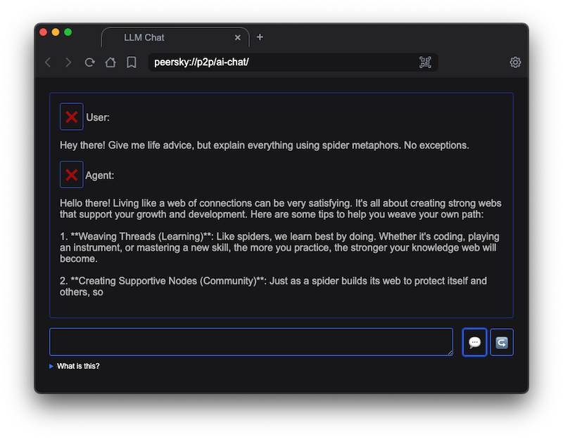

# Local LLMs in PeerSky

Most “AI browsers” sit between you and the web, logging every prompt and response on their own servers. PeerSky does the opposite. It ships with a user-controlled LLM bridge so apps can talk to a model that runs on your own machine, not in someone else’s data center. This design is inspired by [Agregore’s AI and LLM APIs](https://agregore.mauve.moe/docs/ai).

P2P apps can use this bridge to generate text, code, or metadata, then publish the results directly over P2P protocols. No account, no tracking layer, just your browser, your model, and your peers.

## Why run models locally?

- **Privacy-first:** Prompts and generated data never leave your device unless you explicitly publish them.
- **Offline friendly:** Once a model is pulled, it works even when you are disconnected—perfect for P2P and local-first apps.
- **Resource-aware:** Smaller OSS models (e.g. 3B parameters) sip power compared to cloud APIs, cutting cost and footprint.
- **Predictable costs:** You pay once in disk and CPU instead of paying per token or wiring every request through a commercial API.
- **Native to P2P publishing:** Generated content can be shared over IPFS/Hyper directly from the p2p apps.

## Enabling the LLM bridge

1. Open `peersky://settings/llm`.
2. Toggle **Enable Local LLM API**.
3. Choose the **Base URL**, **API Key**, and **Model Name** you want to expose to apps.
4. Save—PeerSky will auto-download the model if it is missing and notify you.


### Field reference

| Setting      | Purpose                                                                                       |
|--------------|------------------------------------------------------------------------------------------------|
| Base URL     | Endpoint for the LLM server. Defaults to `http://127.0.0.1:11434/` for Ollama.                |
| API Key      | `ollama` for local installs, or your cloud token (e.g. OpenRouter).                           |
| Model Name   | Model to expose (default `qwen2.5-coder:3b`). PeerSky will pull it if not present.            |
| Logs button  | Opens real-time download and generation logs.                                                 |

> 💡 If PeerSky cannot reach Ollama it will show a one-time dialog with a shortcut to the Ollama installer. Change the base URL or API key to reset the warning.

Install Ollama from https://ollama.com/download.

## Using cloud providers

Local models are the default in PeerSky, but some developers/users still need access to fast or larger models during prototyping. For that reason, PeerSky also supports hosted providers. It simply gives app authors a way to plug in their own keys when they want more horsepower.

```json
{
  "llm": {
    "enabled": true,
  "baseURL": "https://openrouter.ai/api/v1/",
  "apiKey": "sk-or-...",
  "model": "anthropic/claude-4.5-sonnet"
  }
}
```

Cloud providers skip the download step but the rest of the API is identical.

## Examples of LLM usage in P2P apps



## Developer API

PeerSky exposes the bridge through `window.llm` in P2P apps (see `src/pages/unified-preload.js`). All calls run in the renderer and forward to Electron via IPC.

### Detect support

```js
if (await window.llm?.isSupported()) {
  // safe to use the API
} else {
  alert('This experience requires the PeerSky LLM bridge.');
}
```

### Chat completions (promise)

```js
const messages = [
  { role: 'system', content: 'You help authors polish blog posts.' },
  { role: 'user', content: 'Improve this headline: Local-first Markdown workflows' }
];

const { role, content } = await window.llm.chat({
  messages,
  temperature: 0.6,
  maxTokens: 512
});
```

### Chat completions (streaming)

```js
const output = document.querySelector('#draft');
const messages = [
  { role: 'user', content: 'Generate a three paragraph summary of PeerSky.' }
];

for await (const chunk of window.llm.chat({ messages })) {
  const delta = chunk?.content || '';
  output.textContent += delta;
}
```

### Text completion helper

`window.llm.complete(prompt, options)` is a convenience wrapper that builds a single-message chat under the hood.

```js
const tagline = await window.llm.complete('PeerSky is a browser that', {
  temperature: 0.7,
  maxTokens: 64
});
```

## Security and trusted domains

- `window.llm` is exposed to PeerSky-native pages (`peersky://*`) and P2P protocols (`hyper://`, `ipfs://`, `ipns://`).
- External origins must be on an allowlist (`localhost`, `agregore.mauve.moe`). This prevents arbitrary websites from silently running your local Ollama or burning cloud API credits.

## File reference

| File | Purpose |
|------|---------|
| [src/llm.js](../src/llm.js) | Electron main-process bridge to Ollama/OpenRouter with dialogs & downloads |
| [src/pages/unified-preload.js](../src/pages/unified-preload.js) | Exposes `window.llm` to trusted pages via contextBridge |
| [src/pages/settings.html](../src/pages/settings.html) | UI for LLM config |
| [src/pages/static/js/settings.js](../src/pages/static/js/settings.js) | Renderer logic for saving LLM settings and tracking downloads |
| [src/pages/p2p/](../src/pages/p2p/) | Examples of LLM API usage in the P2P apps like editor and ai chat |
