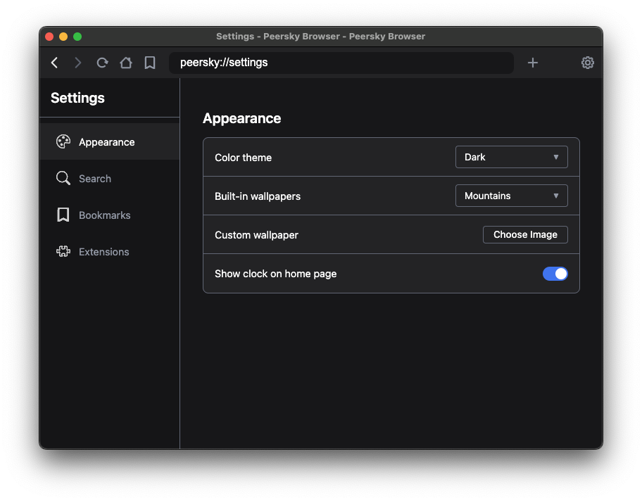
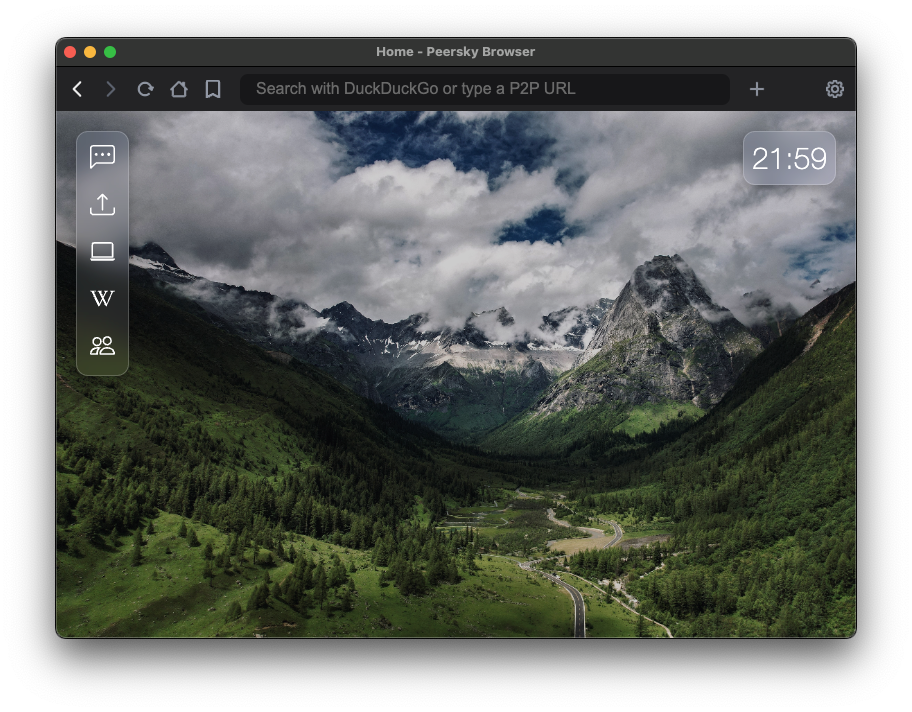

# Peersky Settings (`peersky://settings`)

## 1. Overview

PeerSky’s `peersky://settings` page provides a modular, isolated interface for configuring browser behavior, UI appearance, and local preferences. Each section (Appearance, Search, Bookmarks, Extensions) is routed through a single Electron context-aware page and powered by preload APIs that expose only what’s needed based on page origin.



The settings system is built on top of:

- Electron's `contextBridge` + `ipcRenderer` for secure sandboxed messaging
- JSON-based persistent config saved to the user’s data directory
- Unified preload script (`unified-preload.js`) with page-level scoping


## 2. Electron Integration: Why We Use `contextBridge`

We chose **Electron’s `contextBridge` + `ipcRenderer` pattern** over `webFrame.executeJavaScript()` for one reason: **security and reliability**.

### Why not using`webFrame`?

- ✖ **Async-only**: can’t guarantee synchronous availability on page load
- ✖ **Security risks**: running injected JavaScript defeats context isolation
- ✖ **Hard to audit**: API exposure logic becomes opaque and error-prone

### Why `contextBridge` is better

- ✅ APIs exposed at preload time, scoped to page context (e.g. `peersky://settings`)
- ✅ Keeps Electron’s main process isolated from renderer
- ✅ Only whitelisted functions are exposed (`electronAPI.*`), no leakage
- ✅ Easy to test and trace — all preload logic is in one place:  
  `src/pages/unified-preload.js`

> 📚 [Electron contextBridge documentation](https://www.electronjs.org/docs/latest/api/context-bridge)  
> 📚 [Electron ipcRenderer documentation](https://www.electronjs.org/docs/latest/api/ipc-renderer)


## 3. Settings API: Preload + IPC

All settings-related functionality in Peersky flows through a unified preload and IPC system:

- The preload script (`unified-preload.js`) exposes safe APIs to the renderer via `contextBridge.exposeInMainWorld`.
- The main process (`settings-manager.js`) handles the logic via `ipcMain.handle(...)`.
- Settings are stored in memory and persisted to `settings.json` under Electron’s `userData` path.

### API Overview

| API Method                          | IPC Channel                       | Description                              |
|-------------------------------------|-----------------------------------|------------------------------------------|
| `settings.get(key)`                 | `settings-get`                    | Get a single setting                     |
| `settings.getAll()`                 | `settings-get-all`                | Retrieve all settings                    |
| `settings.set(key, value)`          | `settings-set`                    | Update setting → persist → broadcast     |
| `settings.reset()`                  | `settings-reset`                  | Reset all settings to defaults           |
| `settings.clearBrowserCache()`      | `settings-clear-cache`            | Clears browser cache                     |
| `settings.resetP2PData()`           | `settings-reset-p2p`              | Clears P2P caches                        |
| `settings.uploadWallpaper(data)`    | `settings-upload-wallpaper`       | Save + set custom wallpaper              |
| `getWallpaperUrl()`                 | `settings-get-wallpaper-url`      | Get wallpaper path (async)               |
| `getWallpaperUrlSync()`             | `settings-get-wallpaper-url-sync` | Preload sync load for zero-flicker       |
| `getClockFormatSync()`              | `settings-get-clock-format-sync`  | Preload sync load for clock format       |

### Event Listeners

- `onThemeChanged(cb)`
- `onWallpaperChanged(cb)`
- `onSearchEngineChanged(cb)`
- `onShowClockChanged(cb)`
- `onClockFormatChanged(cb)`

---

## 4. UI Layout & Structure

The settings page is a single HTML document routed via `peersky://settings`, organized into tabs: Appearance, Search, Bookmarks, and Extensions (✅ Complete).

Each section is built using simple HTML blocks styled with internal and theme-provided CSS variables. Navigation is handled client-side.

### Files

| File                  | Role                         |
|-----------------------|------------------------------|
| `settings.html`       | Main layout + content        |
| `settings.css`        | Custom styling per section   |
| `settings.js`         | DOM logic + preload bridge   |
| `unified-preload.js`  | API access                   |


## 5. Settings Functionality

### Wallpaper



- Built-in or uploaded image via `uploadWallpaper(data)`
- Live updated via `wallpaper-changed` event

### Clock

- Toggle visibility via `settings.set('showClock', boolean)`
- Switch between 12-hour and 24-hour formats via `settings.set('clockFormat', '12h' | '24h')`

### Search Engine

- `settings.set('searchEngine', 'DuckDuckGo')`
- Allows user to switch search engines between DuckDuckGo, Brave Search, Ecosia, Kagi, Startpage

### Cache & P2P Data

#### Clear Browser Cache
- **API/IPC:** `settings.clearBrowserCache()` → invokes `ipcMain.handle('settings-clear-cache')`
- **Wipes (Chromium session only):**
  - Cookies
  - LocalStorage / SessionStorage
  - IndexedDB
  - Service Workers
  - Cache Storage
  - HTTP cache (`session.clearCache()`)
- **Does NOT touch:** `ipfs/`, `hyper/`, `ensCache.json`, identity files

#### Reset P2P Data
- **API/IPC:** `settings.resetP2P({ resetIdentities?: boolean })` → `ipcMain.handle('settings-reset-p2p')`
- **Default behavior (`resetIdentities: false`):**
  - Clears P2P caches: `ipfs/` (except `libp2p-key`), `hyper/` (except `swarm-keypair.json`)
  - Removes `ensCache.json`
  - ✅ **Preserves identities:** `ipfs/libp2p-key`, `hyper/swarm-keypair.json`
- **Full wipe (`resetIdentities: true`):**
  - Deletes **all** P2P data including identity files
  - New identities will be generated on next launch


### Extensions Management

- **Extension Installation**: Install from Chrome Web Store URLs or local directories
- **Extension Lifecycle**: Enable, disable, update, and uninstall extensions
- **Security Validation**: Comprehensive manifest validation and permission assessment
- **Settings Integration**: Complete extension management interface in settings tab

**Extension APIs**:
- `extensionAPI.listExtensions()` - Get all installed extensions
- `extensionAPI.installFromWebStore(urlOrId)` - Install from Chrome Web Store
- `extensionAPI.toggleExtension(id, enabled)` - Enable/disable extension
- `extensionAPI.uninstallExtension(id)` - Remove extension
- `extensionAPI.updateAll()` - Update all extensions

## 6. Adding a New Setting (Example: `autoSave`)

To add a new setting (e.g. `autoSave: true`), follow these five steps across the relevant files.

###  Define Default & Validation

📄 `settings-manager.js`

```js
// 1. Add to default settings
const defaultSettings = {
  theme: 'system',
  searchEngine: 'startpage',
  showClock: true,
  autoSave: true, // ← new
};

// 2. Extend validation
function validateSetting(key, value) {
  switch (key) {
    case 'theme': return ['light', 'dark', 'system'].includes(value);
    case 'autoSave': return typeof value === 'boolean'; // ← new
    ...
  }
}
```

###  Apply & Broadcast Updates

📄 `settings-manager.js`

```js
function applySettingChange(key, value) {
  settings[key] = value;

  if (key === 'autoSave') {
    mainWindow.webContents.send('auto-save-changed', value); // ← new
  }

  persistSettings();
}
```

###  Preload Exposure

📄 `unified-preload.js`

```js
contextBridge.exposeInMainWorld('electronAPI', {
  ...
  onAutoSaveChanged: (cb) => ipcRenderer.on('auto-save-changed', (_, v) => cb(v)), // ← new
});
```

###  UI: Add Toggle in HTML + Hook Up Logic

📄 `settings.html`

```html
<section id="behavior">
  <label>
    <input type="checkbox" id="autoSaveToggle" />
    Enable Auto-Save
  </label>
</section>
```

📄 `settings.js`

```js
const autoSaveToggle = document.getElementById('autoSaveToggle');

electronAPI.settings.get('autoSave').then((v) => {
  autoSaveToggle.checked = v;
});

autoSaveToggle.addEventListener('change', () => {
  electronAPI.settings.set('autoSave', autoSaveToggle.checked);
});
```

### ✅ Done

This fully wires up `autoSave`:
- default value
- validation
- sync to `settings.json`
- live reactivity via IPC + event listener
- UI toggle


## 7. File Reference:

| File                    | Purpose                          |
|-------------------------|----------------------------------|
| [settings.html](src/pages/settings.html)         | Settings layout & anchors        |
| [settings.css](src/pages/theme/settings.css)          | Styling for settings tabs        |
| [settings.js](src/pages/settings.js)           | DOM glue + preload calls         |
| [unified-preload.js](src/pages/unified-preload.js)    | Scoped API exposure              |
| [settings-manager.js](src/settings-manager.js)   | IPC handlers & persistence       |
| [Theme.css](src/pages/theme/Theme.css)             | Theme variables                  |
| [home.js](src/pages/home.js)               | Applies wallpaper + clock        |
| [peersky-protocol.js](src/protocols/peersky-protocol.js)   | Serves custom wallpaper files    |
