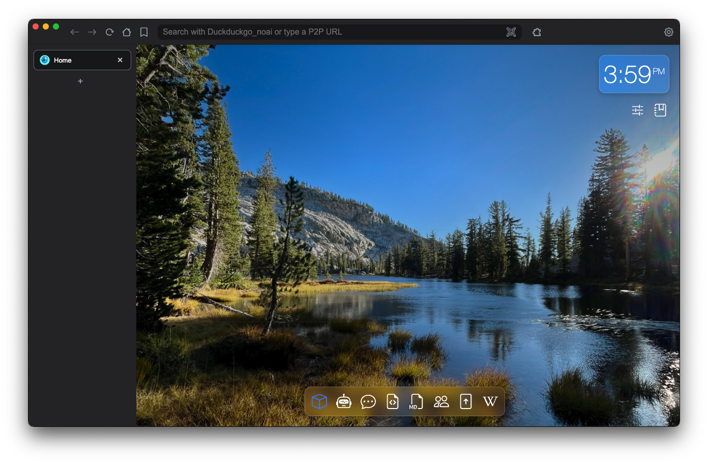
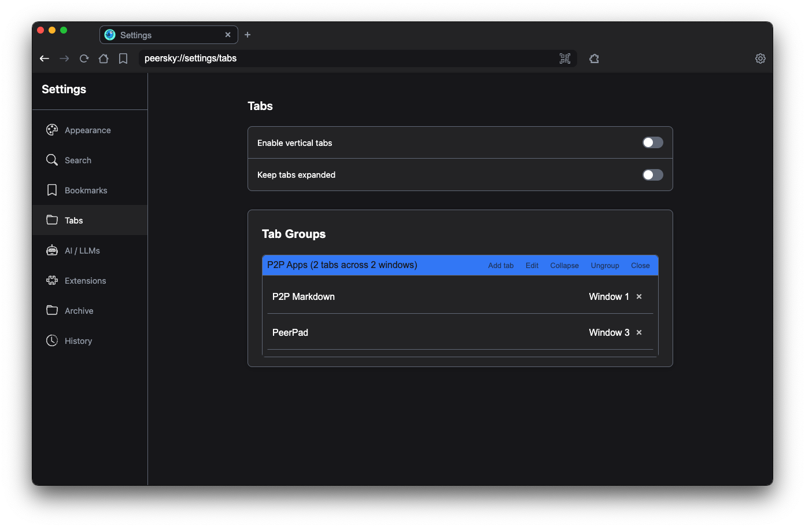
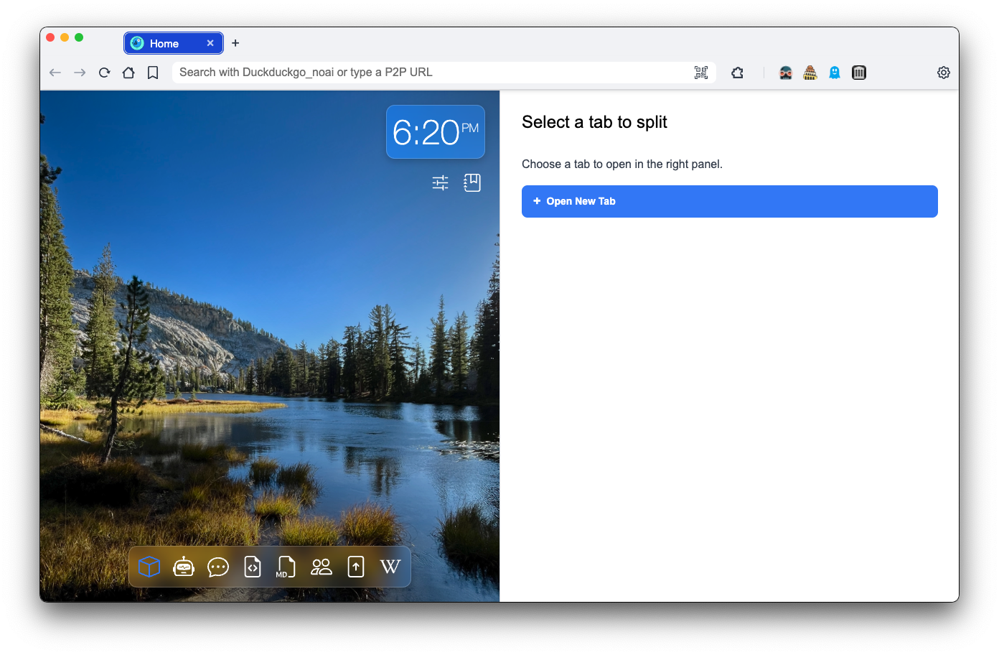
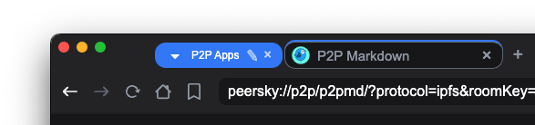
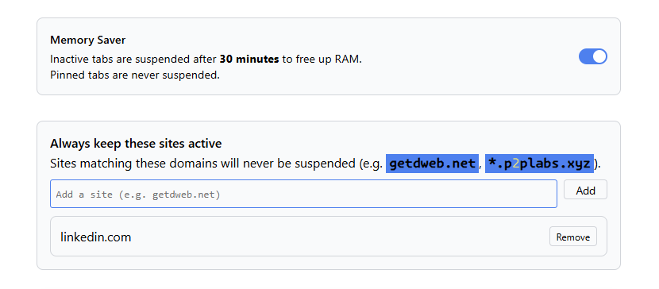
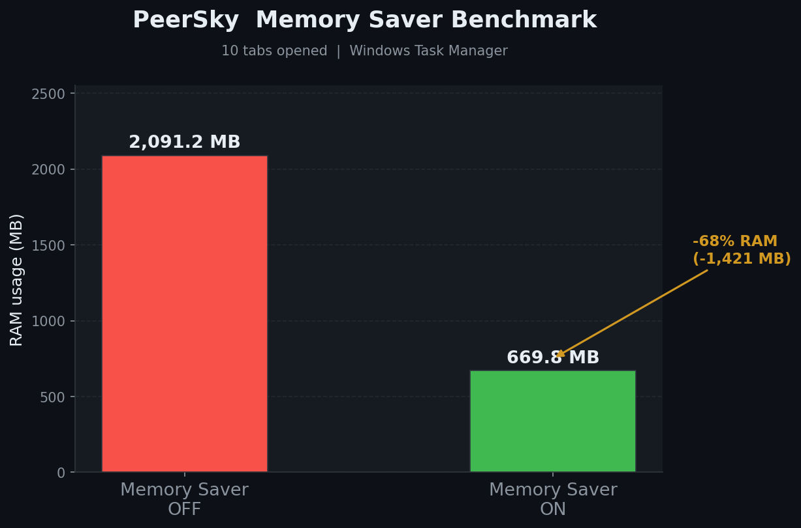
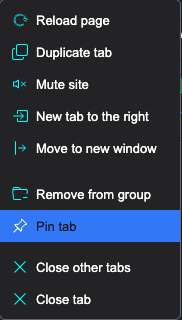

# Tabs (`peersky://settings/tabs`)

## 1. Overview

Peersky's tab system provides a full-featured browser tab experience with support for horizontal and vertical layouts, tab groups, pinning, drag-and-drop reordering, and a **Memory Saver** (tab suspension) feature that reduces RAM usage when tabs are idle.

Tab state — including open tabs, active tab, groups, pinned status, and navigation history — is persisted to `localStorage` under the key `peersky-browser-tabs`, keyed by window ID.

---

## 2. Tab Bar Layout

Tabs can be displayed in two modes, configurable from **Settings → Tabs**:

| Mode | Description |
|------|-------------|
| **Horizontal** (default) | Tab strip runs along the top of the browser |
| **Vertical** | Tab strip runs along the left side (enable via "Enable vertical tabs" toggle) |

The **"Keep tabs expanded"** toggle keeps each tab full-width in vertical mode, rather than collapsing to just a favicon.

---

## 3. Tab Lifecycle

### Creating Tabs

- **New tab button** (`+`): opens `peersky://home`
- **Keyboard shortcut** (`CommandOrControl+T`) / context menus: open a URL directly in a new tab

### Switching Tabs

- **Next Tab**: `CommandOrControl+Tab` (Windows/Linux) / `CommandOrControl+Option+Right` (macOS)
- **Previous Tab**: `CommandOrControl+Shift+Tab` (Windows/Linux) / `CommandOrControl+Option+Left` (macOS)

### Closing Tabs

- Close button (`×`) on the tab
- Context menu → **Close tab**
- **Keyboard shortcut**: `CommandOrControl+Shift+W`
- Closing the last tab creates a fresh home tab

### Restoring Tabs on Restart

On startup, tabs are restored from `localStorage`. Each tab record includes:
- `id`, `url`, `title`, `protocol`
- `isPinned`, `groupId`
- `isSuspended` — whether the tab was sleeping when the browser closed
- `navigation` — back/forward history snapshot

Active tab, tab counter, and tab group definitions are also restored.

---

## 4. Tab Groups

Tab groups allow you to visually organize related tabs with a shared color border and an optional label.

### Creating a Group

1. Right-click a tab → **Add to group** → **New group**
2. Name the group and choose a color.

### Managing Groups

- Tabs in the same group show a colored top border.
- Groups can be expanded (tabs visible) or collapsed (tabs hidden, showing only the group header).
- Drag tabs between groups or out of a group entirely.

### Persistence

Tab group definitions (id, name, color, expanded state) and each tab's `groupId` are saved to `localStorage` on every state change and on browser close.

---

## 5. Split View

Split View allows you to dock two tabs side-by-side within the same window, maximizing screen real estate for multitasking without needing multiple browser windows. 

### Initiating a Split

1. Right-click any active tab and select **Split view**.
2. The browser will split the screen and display the **Split Selector Overlay** on the right side.
3. Choose an existing open tab from the list, or click **+ Open New Tab** to create a fresh webview for the right panel.

### Managing Split Pairs

- **Resizable Panes:** Hover over the vertical dividing line between the two webviews and drag left or right to adjust the split ratio (e.g., 50/50, 70/30). The custom ratio is preserved during your session.
- **Drag & Drop:** Dragging a split tab within the tab bar will automatically grab its partner, moving them together as a single unified block. 
- **Tear-off:** Dragging a split pair *outside* the tab bar will extract the split pair tab you grabbed into a new isolated window.
- **Separating:** To break a split inside the current window, right-click either half of the split tab and select **Separate split view**.

### Persistence

Split View configurations are fully persistent. The exact pairing of the tabs, their DOM order, and their custom split ratio are serialized into the `splitPairs` array and saved to `localStorage`. Upon restarting the browser, the split groups are automatically rebuilt and snapped back together.

---

## 6. Pinned Tabs

- Right-click a tab → **Pin tab** to pin it.
- Pinned tabs:
  - Show only a favicon (no close button, no title in horizontal mode).
  - Are never automatically suspended by Memory Saver.
  - Their pinned state is restored on restart.

---

## 7. Memory Saver

Memory Saver automatically **suspends** inactive background tabs to free RAM. Configure it under **Settings → Tabs → Memory Saver**.

### How It Works

1. A background check runs every **60 seconds**.
2. Each non-active, non-pinned, non-suspended tab is evaluated:
   - **Idle time** — last active more than 30 minutes ago?
   - **Audibility** — playing audio/video? → skip.
   - **Exclusion list** — URL matches an exclusion pattern? → skip.
3. Tabs that pass all checks are suspended: history is saved, webview is destroyed.

### Suspension

- `get-tab-navigation` captures the back/forward history into `tab.savedNavigation`.
- The webview is removed from the DOM; `tab.isSuspended = true` is set.
- The tab gains the `sleeping` CSS class.

### Waking Up

- A new webview is created for the tab's URL.
- `restore-navigation-history` (in `main.js`) is a **no-op** — Electron cannot rebuild a WebContents history stack after recreation.
- Back/forward is handled in the UI layer via `tab.savedNavigation` (URL array + active index).

### Persistence Across Restarts

`isSuspended` and `savedNavigation` are saved in `localStorage` by `getTabsStateForSaving()`. On restart, `restoreTabs()` skips creating a webview for suspended tabs and restores the `sleeping` class. The URL list and active position are preserved, but this is **not** a native browser history.

### Exclusion List

| Pattern | Matches |
|---------|---------|
| `getdweb.net` | That domain and all subdomains |
| `*.p2plabs.xyz` | Any subdomain of `p2plabs.xyz` |
| `https://app.example.com/dashboard` | That exact URL prefix |
| `peersky://p2p/*` | Any internal peersky P2P app |

### Settings

| Key | Type | Default | Description |
|-----|------|---------|-------------|
| `memorySaverEnabled` | `boolean` | `false` | Enable/disable globally |
| `memorySaverExclusions` | `string[]` | `['peersky://p2p/*']` | Patterns exempt from suspension |

Changes are applied immediately via the `memory-saver-changed` IPC event.

### Benchmark

> 10 tabs opened, measured via Windows Task Manager.
>
> | Condition | RAM usage | Savings |
> |-----------|-----------|---------|
> | Memory Saver **OFF** | 2,091.2 MB | — |
> | Memory Saver **ON** | 669.8 MB | **−68 % (−1,421 MB)** |
>

---

## 8. Tab Context Menu

Right-clicking any tab opens a context menu with:

| Action | Description |
|--------|-------------|
| Pin / Unpin tab | Toggle pinned state |
| Duplicate tab | Open a copy of the current tab |
| Move to group… | Assign tab to an existing or new group |
| Remove from group | Detach tab from its current group |
| Close tab | Close the tab |
| Close other tabs | Close all tabs except this one |
| Close tabs to the right | Close tabs to the right of this one |

---

## 9. Hover Card

Hovering over a tab for ~800 ms shows a hover card with:
- Tab title and full URL
- Live memory usage (MB) from the main process, or `"Tab is sleeping"` for suspended tabs

---

## 10. File Reference

| File | Purpose |
|------|---------|
| [tab-bar.js](../src/pages/tab-bar.js) | Core tab management (TabBar custom element) |
| [tabs.css](../src/pages/theme/tabs.css) | Tab bar and tab element styling |
| [settings.html](../src/pages/settings.html) | Memory Saver UI (Tabs → Memory Saver subsection) |
| [settings.js](../src/pages/static/js/settings.js) | Memory Saver settings load/save logic |
| [settings-manager.js](../src/settings-manager.js) | `memorySaverEnabled` / `memorySaverExclusions` IPC handlers |
| [main.js](../src/main.js) | `get-tab-navigation`, `restore-navigation-history`, `is-webcontents-audible` IPC handlers |
