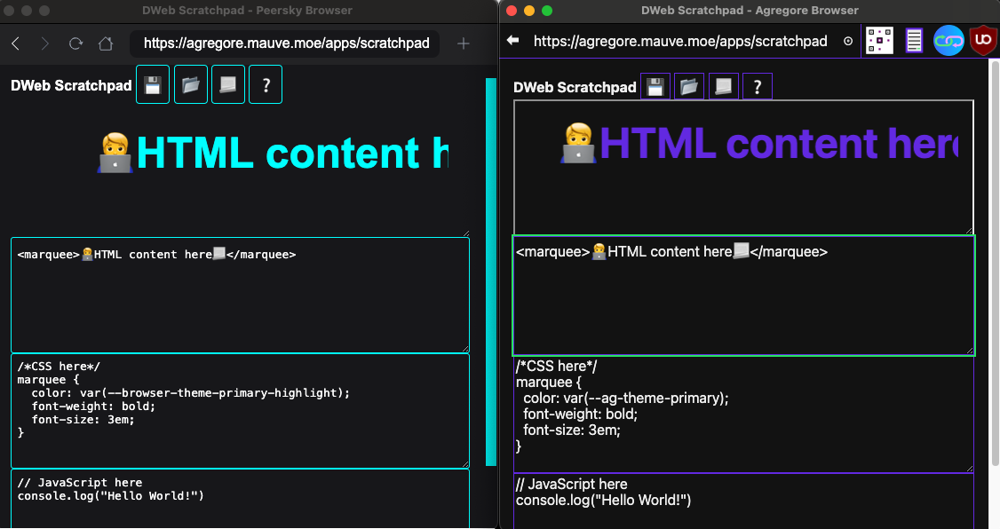

# Theme Protocol (`browser://theme/`)

## Overview

The `browser://theme/` protocol provides a standardized way for web applications to access browser-level CSS styles and theme variables in [Peersky](https://peersky.p2plabs.xyz/) and other compatible browsers, such as [Agregore](https://agregore.mauve.moe/). This protocol ensures consistent theming across different browsers by serving CSS files with a common set of variables. It allows developers to build applications that adapt to the browser's theme without needing browser-specific code.



## Purpose

The goal of the `browser://theme/` protocol is to:

- Enable cross-browser compatibility for theming in any browser, including p2p browsers like Peersky and Agregore.
- Provide a unified set of theme variables using standardized `--browser-theme-` prefixes.
- Allow web applications to import styles or variables without hardcoding browser-specific protocols (e.g., `peersky://` or `agregore://`).

## Implementation

### Protocol Handler

The `browser://theme/` protocol is implemented in Peersky via a custom Electron protocol handler (`theme-handler.js`). It serves CSS files from the `src/pages/theme/` directory when requests are made to URLs like `browser://theme/vars.css` or `browser://theme/style.css`.

- **Location**: Files are stored in `src/pages/theme/` (e.g., `vars.css`, `style.css`, `base.css`, `index.css`).
- **URL Structure**: Requests to `browser://theme/<filename>` map to `src/pages/theme/<filename>`.
- **Example**: `browser://theme/vars.css` serves `src/pages/theme/vars.css`.

### Theme Variable Standardization

The `browser://theme/` protocol provides standardized theme variables prefixed with `--browser-theme-`, such as `--browser-theme-font-family`, `--browser-theme-background`, `--browser-theme-text-color`, `--browser-theme-primary-highlight`, and `--browser-theme-secondary-highlight`. These variables allow web applications to adapt to the host browser's theme without needing browser-specific code.

Each browser implements these standardized variables by mapping them to their internal theme variables. For example:

- In Peersky, `--browser-theme-background` is mapped to `--base01`, which is part of the Base16 color palette [Base16 Framework](https://github.com/chriskempson/base16).
- In Agregore, `--browser-theme-background` is mapped to `--ag-theme-background`, which is defined in Agregore's theme configuration.

This ensures that applications built for one browser can work seamlessly in another, as long as they use the standardized `--browser-theme-` variables.

### Cross-Browser Compatibility

The `browser://theme/` protocol enables apps built for one browser to work seamlessly in another by providing standardized theme variables prefixed with `--browser-theme-`. These variables are mapped to each browser's internal theme variables, ensuring consistent theming across different browsers.

For example:

- In Peersky, `--browser-theme-background` is mapped to `--base01`, which is part of the Base16 color palette.
- In Agregore, `--browser-theme-background` is mapped to `--ag-theme-background`, which is defined in Agregore's theme configuration.

As a result, an app using `--browser-theme-background` will render with the appropriate background color for each browser, whether it's based on Base16 (as in Peersky) or another theme system (as in Agregore).

Additionally, apps can use the full set of variables provided by each browser for more advanced theming, but for cross-browser compatibility, it's recommended to use the standardized `--browser-theme-` variables.

## Usage

### Importing Theme Styles

Web applications can import theme styles or variables using `<style>` tags or `<link>` elements. Examples:

- **Import Variables**:

  ```html
  <style>
    @import url("browser://theme/vars.css");
    body {
      background-color: var(--browser-theme-background);
      color: var(--browser-theme-text-color);
    }
  </style>
  ```

- **Import Default Styles**:

  ```html
  <link rel="stylesheet" href="browser://theme/style.css" />
  ```

- **Use Browser-Specific Variables** (for Agregore apps in Peersky):
  ```html
  <style>
    @import url("browser://theme/vars.css");
    body {
      background-color: var(
        --ag-theme-background
      ); /* Maps to --browser-theme-background */
    }
  </style>
  ```

## Theme Files (`browser://theme/`)

- `vars.css`: Defines standardized `--browser-theme-`, Base16, and Peersky-specific CSS variables for theming.
- `base.css`: Applies minimal default styles for unstyled pages, auto-injected by preload.
- `style.css`: Opt-in comprehensive styling for web apps
- `index.css`: Styles Peersky’s browser UI (e.g., navigation bar, URL input).
- `home.css`: Styles Peersky’s home page with a background image and sidebar.
